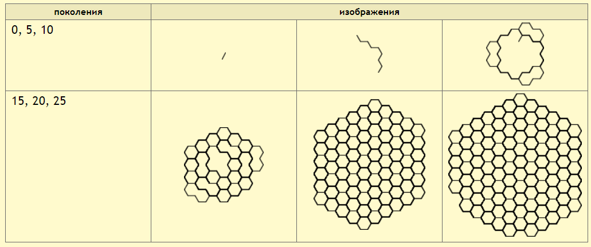
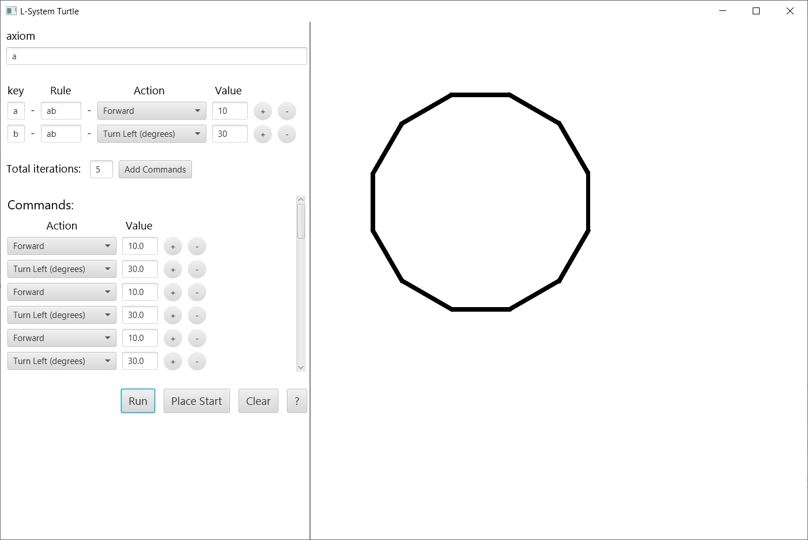
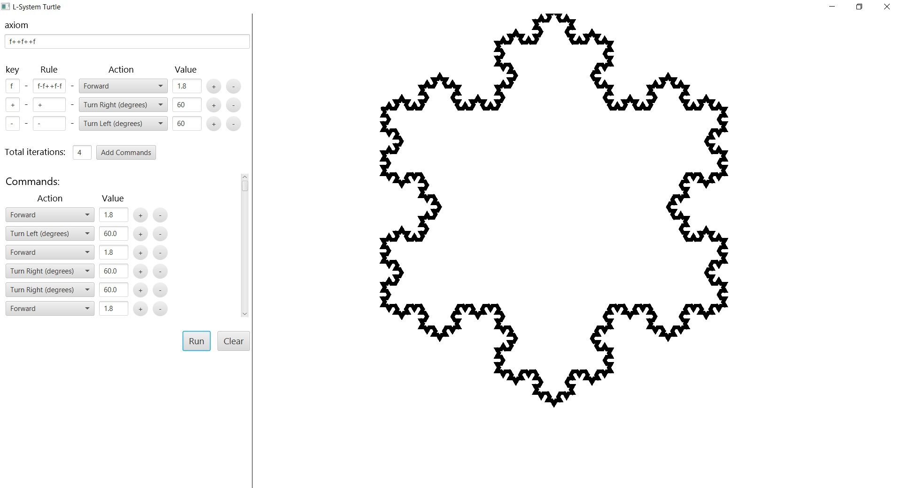
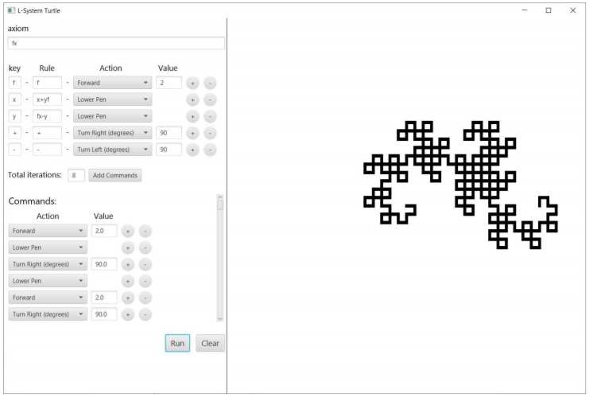

# Что такое Л-Система?
[Подробности здесь](http://mech.math.msu.su/~shvetz/54/inf/perl-problems/chLSystems.xhtml)

Вкратце на примере:

Есть алфавит. Пусть содержит **А** и **В**.

Есть правила. Пусть будут:
*   **А** → **B**
*   **B** → **AB**

Есть аксиома - первоначальное состояние. Пусть будет **А**.

Развитие L-системы происходит циклически. В каждом цикле развития строка просматривается от начала к концу, символ за символом. Для каждого символа ищется правило, для которого этот символ служит предшественником. Если такого правила не нашлось, символ оставляется без изменений.

Развитие системы:

0. А
1. В
2. АВ
3. ВАВ
4. АВВАВ

Введем интерпретацию. Пусть будет:
* **А**: повернуть на 60 градусов, вперед 1
* **В**: повернуть на -60 градусов, вперед 1

Тогда получится:

# Приложение
Можно задать аксиому, алфавит, правила, интерпретацию, количество итераций.

После нажатия `Add Commands` произойдет расчет, команды добавятся в список команд.

Список команд можно также редактировать вручную - полноценная черепашка.

Выполнение списка команд (отрисовка) происходит при нажатии `Run`.

`Place Start` позволяет выбрать точку старта отрисовки на области рисования.

Написано на Java с использованием JavaFX.

# Примеры работы программы

